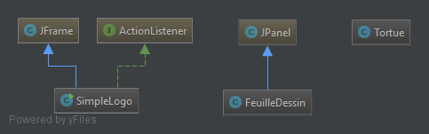
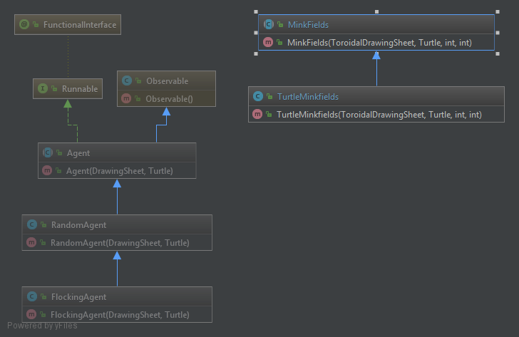
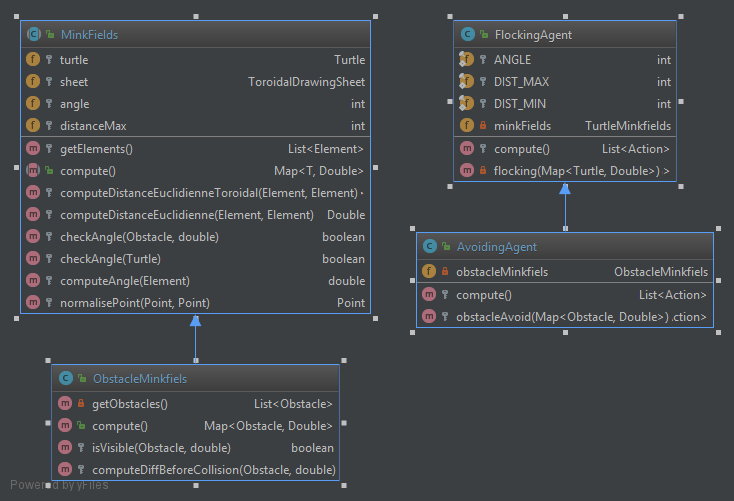

**GORY / Alexandre Etudiant 1 :**

**PRIEUR-DREVON / Thomas Etudiant 2 :**

# Rapport TP4

## Question 1
*Exprimer les données de test*



Problèmes liés au code :

    - Plusieurs classes par fichier : 
        + **Tortue.class** -> 2 classes Tortue et segment dans le même fichier (à séparer)
    - Méthode trop longue : 
        + SimpleLogo logoInit (à diviser)
        + SimpleLogo actionPerformed if imbriqué, remplacement possible par un switch case
    
Problème lié à la structure de code :

    - Responsabilité unique :
        +  Les classes gérent à la fois la logique métier et d'affichage
            -> Solution utilisation du model MVC
        + Simple Logo jouent le rôle de controller et de view
   
   
     

## Question 2
*Rien à rédiger*

## Question 3
*Rien à rédiger*

## Question 4
*Rien à rédiger*


## Question 5
Pour implémenter les agents aléatoires, j'ai choisi que l'agent soit une entité indépendante, c'est-à-dire qu'il est
dans son propre thread et agit tous les certains laps de temps. Il s'agit de la classe abstraite Agent qui ne gère que
la partie Thread. Cette classe dispose d'une méthode abstraite *compute* afin de pouvoir implémenter le comportement de l'agent.


Par la suite j'ai crée une classe RandomAgent qui implémente les décisions aléatoires de l'agent.
```java 
 protected List<Action> compute() {
        Random random = new Random();
        List<Action> actions = new ArrayList<>();
        int number = random.nextInt(3);
        if(number > 3)
            number = 0;
        switch (number) {
            case 0:
                actions.add(new MoveForward(1));
                break;
            case 1:
                actions.add(new TurnLeft(3));
                actions.add(new MoveForward(1));
                break;
            case 2:
                actions.add(new TurnRight(3));
                actions.add(new MoveForward(1));
                break;
            default:
                actions.add(new MoveForward(0));
                break;
        }
        return actions;
    }
```

## Question 6


Pour réaliser le flocking, j'ai réalisé un héritage avec  RandomAgent pour garder le comportement précédent lorsqu'il
n'y a aucune tortue proche. Cette nouvelle classe FlockingAgent a un comportement qui ce modifie si des tortues sont
proches. Lorsque l'agent détecte des tortues voisins, elle met à jour ça direction pour avoir la moyenne de la direction
de tous les voisins.

Pour détecter les voisin, j'ai créé un classe TurtleMinkfields qui est du coup un composant de FlockingAgent. Ce
composant permet de recupérer les tortues proches. 




Pour récupérer les tortues proches je calcule la distance euclidienne en prennant en compte l'environement toroïdal. 


## Implémentation des obstacles

Pour implémenter l'évitement d'obstacles, j'ai créé une classe ObstacleMinkfields qui permet de détecter les obstacles.

De plus, j'ai crée une classe AvoidingAgent qui ajoute les comportements d'évitement d'obstacles. Lorsqu'il n'y a pas
d'obstacles, le comportement de flocking est appliqué.
 
 

 ## Fonctionnalités bonus implémentées bugguées
 
 Nous avons essayer d'implémenter un angle de vision afin d'éviter que les agents ne soient influencés par les agents
 derrière eux. Cependant, il y a de nombreux bugs concernant cette fonctionnalité, elle est donc désactivée dans le projet.
 


